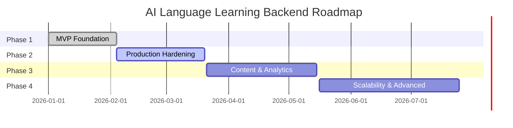

# Project Roadmap

**Last Updated:** 2026-02-04
**Project:** AI Language Learning Backend
**Status:** Phase 1 Complete, Phase 2 In Progress

## Vision

Build a scalable, production-ready backend infrastructure that powers AI-driven language learning experiences with multi-platform support, comprehensive observability, and enterprise-grade security.

## Roadmap Phases

### Phase 1: MVP Foundation ✅ (Complete - 2026-02-04)

**Duration:** 8 weeks
**Status:** ✅ Complete
**Progress:** 100%

**Objectives:**
- Establish core backend infrastructure
- Implement authentication system
- Integrate AI providers
- Set up subscription management
- Deploy push notification system

**Deliverables:**

| Feature | Status | Completion Date |
|---------|--------|-----------------|
| NestJS project structure | ✅ | 2026-01-15 |
| PostgreSQL + TypeORM setup | ✅ | 2026-01-15 |
| Supabase integration | ✅ | 2026-01-16 |
| Email/password authentication | ✅ | 2026-01-18 |
| Google OAuth integration | ✅ | 2026-01-19 |
| Apple Sign-In integration | ✅ | 2026-01-20 |
| JWT refresh token mechanism | ✅ | 2026-01-21 |
| User profile management | ✅ | 2026-01-22 |
| Language catalog & preferences | ✅ | 2026-01-23 |
| LangChain AI integration | ✅ | 2026-01-25 |
| Multi-provider LLM support | ✅ | 2026-01-27 |
| Chat & conversation endpoints | ✅ | 2026-01-28 |
| Grammar checking service | ✅ | 2026-01-29 |
| Exercise generation | ✅ | 2026-01-30 |
| Pronunciation assessment (Whisper) | ✅ | 2026-01-31 |
| RevenueCat webhook integration | ✅ | 2026-02-01 |
| Subscription status API | ✅ | 2026-02-02 |
| Firebase FCM integration | ✅ | 2026-02-03 |
| Device token management | ✅ | 2026-02-03 |
| Swagger documentation | ✅ | 2026-02-04 |
| Database migrations | ✅ | 2026-02-04 |

**Success Metrics:**
- ✅ 20+ API endpoints operational
- ✅ 6 feature modules implemented
- ✅ 12 database entities with RLS
- ✅ 10 AI models supported
- ✅ Global auth guard functional
- ✅ Swagger docs auto-generated
- ✅ Zero critical security vulnerabilities

---

### Phase 2: Production Hardening 🔄 (In Progress)

**Duration:** 6 weeks
**Status:** 🔄 In Progress
**Progress:** 15%
**Target Completion:** 2026-03-20

**Objectives:**
- Implement comprehensive testing
- Add rate limiting and caching
- Enhance observability
- Improve error handling
- Performance optimization

**Deliverables:**

| Feature | Priority | Status | Target Date |
|---------|----------|--------|-------------|
| Unit test coverage (>80%) | High | 🔄 15% | 2026-02-20 |
| E2E test suite | High | 📋 Planned | 2026-02-25 |
| Redis caching layer | High | 📋 Planned | 2026-03-01 |
| Per-user rate limiting | High | 📋 Planned | 2026-03-05 |
| Health check endpoints | Medium | 📋 Planned | 2026-03-08 |
| Langfuse advanced tracing | Medium | 📋 Planned | 2026-03-10 |
| Database query optimization | High | 📋 Planned | 2026-03-12 |
| Response caching strategy | Medium | 📋 Planned | 2026-03-15 |
| API versioning | Low | 📋 Planned | 2026-03-18 |
| Comprehensive error codes | Medium | 📋 Planned | 2026-03-20 |

**Success Metrics:**
- Test coverage >80%
- API response time p95 <500ms
- Zero N+1 query issues
- Health checks passing
- Cache hit rate >60% (frequently accessed data)

---

### Phase 3: Content & Analytics 📋 (Planned)

**Duration:** 8 weeks
**Status:** 📋 Planned
**Target Start:** 2026-03-21
**Target Completion:** 2026-05-15

**Objectives:**
- Build content management system
- Implement analytics tracking
- Add admin dashboard
- Email notification service
- User progress tracking

**Deliverables:**

| Feature | Priority | Target Date |
|---------|----------|-------------|
| Lesson content CMS | High | 2026-04-05 |
| Exercise content management | High | 2026-04-10 |
| User progress tracking | High | 2026-04-15 |
| Learning analytics dashboard | Medium | 2026-04-20 |
| Email notification service | High | 2026-04-25 |
| Admin user management panel | Medium | 2026-05-01 |
| Content recommendation engine | Low | 2026-05-10 |
| Usage analytics API | Medium | 2026-05-15 |

**Success Metrics:**
- 50+ lessons in content library
- Progress tracking for all users
- Email delivery rate >95%
- Admin dashboard operational
- Analytics data retention 90d

---

### Phase 4: Scalability & Advanced Features 📋 (Planned)

**Duration:** 10 weeks
**Status:** 📋 Planned
**Target Start:** 2026-05-16
**Target Completion:** 2026-07-25

**Objectives:**
- Background job processing
- Real-time features
- Social features
- Advanced AI capabilities
- Multi-region deployment

**Deliverables:**

| Feature | Priority | Target Date |
|---------|----------|-------------|
| Bull/BullMQ job queue | High | 2026-05-25 |
| WebSocket real-time chat | Medium | 2026-06-01 |
| User friends system | Low | 2026-06-08 |
| Leaderboards & achievements | Low | 2026-06-15 |
| Gamification engine | Low | 2026-06-22 |
| Voice-based learning (STT/TTS) | Medium | 2026-06-29 |
| AI conversation memory | High | 2026-07-06 |
| Multi-region database | High | 2026-07-13 |
| Read replicas | Medium | 2026-07-20 |
| GraphQL API | Low | 2026-07-25 |

**Success Metrics:**
- Background jobs processing >1000/min
- WebSocket latency <100ms
- Multi-region latency <200ms
- GraphQL queries functional
- Social features engagement >30%

---

## Milestone Timeline

## Current Sprint (Week of 2026-02-03)

**Sprint Goal:** Complete documentation and begin testing infrastructure

**Tasks:**
- ✅ Generate comprehensive codebase summary
- ✅ Update system architecture docs
- ✅ Create project roadmap
- 🔄 Set up Jest testing infrastructure
- 📋 Write auth module unit tests
- 📋 Write AI module unit tests
- 📋 Configure test coverage reporting

## Key Dependencies

### Phase 2 Dependencies
- Jest configuration finalized
- Test database setup
- Mock AI provider responses
- Redis instance provisioned

### Phase 3 Dependencies
- Content schema finalized
- Email service provider selected (SendGrid/Mailgun)
- Admin UI framework chosen
- Analytics data model designed

### Phase 4 Dependencies
- Job queue infrastructure (Redis)
- WebSocket server configuration
- Multi-region strategy approved
- GraphQL schema design

## Risk Management

### Current Risks

| Risk | Impact | Probability | Mitigation |
|------|--------|-------------|------------|
| AI provider API rate limits | High | Medium | Implement request caching, multiple providers |
| Database connection exhaustion | High | Low | Connection pooling, query optimization |
| Webhook processing delays | Medium | Medium | Async processing, job queue |
| Test coverage gaps | Medium | High | Automated coverage reports, CI integration |
| Third-party service outages | High | Low | Multi-provider fallbacks, circuit breakers |

### Resolved Risks

| Risk | Resolution | Date Resolved |
|------|-----------|---------------|
| Authentication security | Implemented bcrypt + JWT + RLS | 2026-01-21 |
| Webhook authorization | Bearer token validation | 2026-02-01 |
| API documentation gaps | Swagger auto-generation | 2026-02-04 |

## Success Criteria

### Overall Project Success
- ✅ MVP deployed and functional
- 📋 Production-grade test coverage (>80%)
- 📋 API response time <500ms (p95)
- 📋 99.9% uptime SLA
- 📋 Zero critical security vulnerabilities
- 📋 100+ daily active users
- 📋 5+ supported AI models in production

### Phase 2 Success Criteria
- Test coverage >80%
- Redis caching operational
- Health checks passing
- Rate limiting enforced
- API documentation complete

### Phase 3 Success Criteria
- Content CMS operational
- Analytics tracking implemented
- Email notifications sent
- Admin dashboard accessible
- User progress tracked

### Phase 4 Success Criteria
- Background jobs processing
- WebSocket chat functional
- Multi-region deployment
- Social features live
- GraphQL API available

## Version History

### v1.0.0 (2026-02-04) - Current
- MVP release with core features
- 6 feature modules operational
- 20+ API endpoints
- 10 AI models supported
- Swagger documentation
- Database migrations

### v1.1.0 (Planned: 2026-03-20)
- Comprehensive test coverage
- Redis caching
- Rate limiting
- Health checks
- Performance optimizations

### v2.0.0 (Planned: 2026-05-15)
- Content management system
- Analytics tracking
- Email notifications
- Admin dashboard
- User progress tracking

### v3.0.0 (Planned: 2026-07-25)
- Background job processing
- Real-time features
- Social features
- Advanced AI capabilities
- Multi-region deployment

## Contributing

Development follows agile methodology with 2-week sprints. See [`docs/code-standards.md`](./code-standards.md) for coding guidelines and [`docs/system-architecture.md`](./system-architecture.md) for architectural patterns.

## Resources

- **Documentation:** `./docs/`
- **Issue Tracking:** GitHub Issues
- **Project Board:** GitHub Projects
- **API Docs:** `/api/docs` (Swagger)
- **Architecture:** [`docs/system-architecture.md`](./system-architecture.md)
- **Code Standards:** [`docs/code-standards.md`](./code-standards.md)
